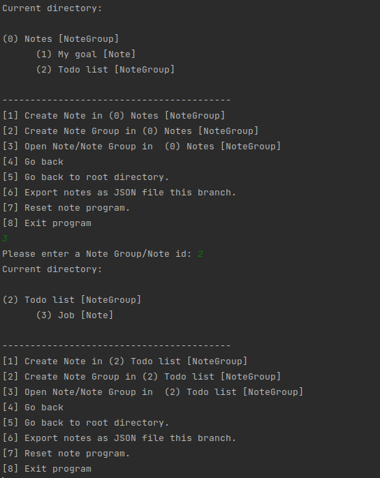
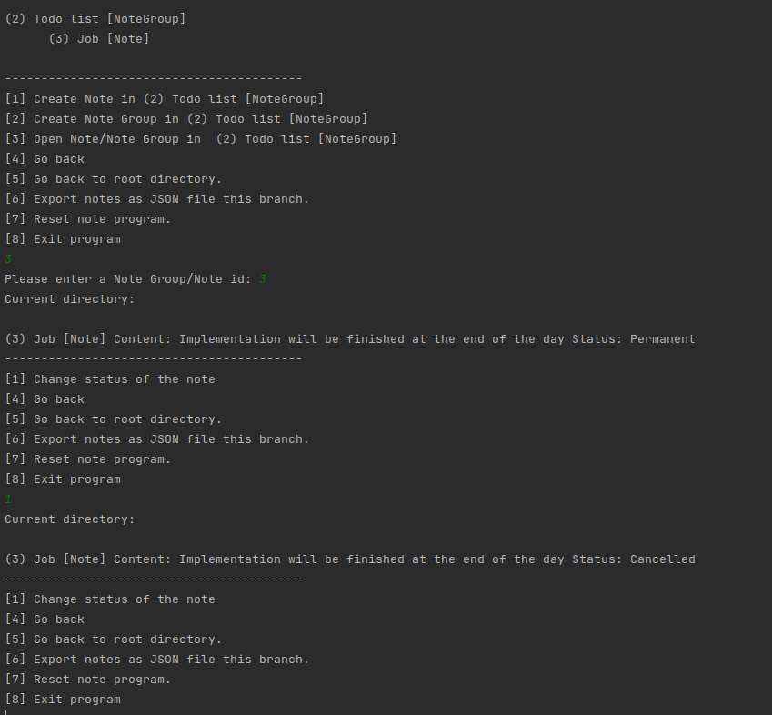

# Note Application

## Introduction

- In the Note Application; user can take notes and create note groups, which are composed of notes. Under
  a note group, user can create notes or other note groups and so on.

- Each **note group** has an **id** and **title**; each **note** has an **id**, **title**, **content**, **state**, and **date**.
  When users list their notes, they can only see their ids and title (notes and note groups are listed
  together and each of them has  a unique id). If the users enter the id of a note, they  see the
  content of that note; if the users enter the id of a note group, the notes and note groups that are
  under this note group are listed.

- Notes have four states : **Incomplete** , **Completed** , **Cancelled** , **Permanent**

- User can create a note as **incomplete** or **permanent**. If a note created as **incomplete**, it can be changed
  as completed or cancelled and cannot be changed to permanent. If a note created as **permanent**, it can
  only be changed as **cancelled**. **Completed** and **cancelled** states cannot be changed. Users cannot delete a
  note or a note group. They can only change states of notes.

- In the main menu, users can choose to go their notes, export their whole notes as JSON file, and
  reset the program completely (every note or note group will be deleted).

## Structure

- Project was implemented by using **Composite Design Pattern** and **State Design Pattern**.

- The **State Design Pattern** was used to create different types of states for the notes 
and handle changes from one state to another.

- As there is a part-whole object hierarchy between  **note groups** and **note**, 
**Composite Design pattern** was used.

- Project can be tested and run in the **Program** package.

## Screenshots

   

